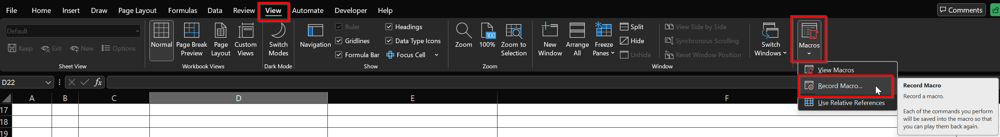
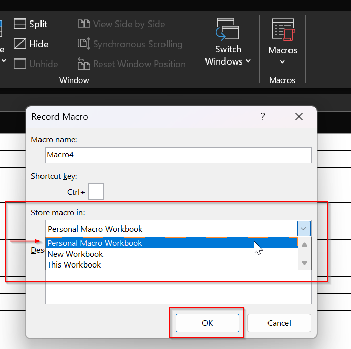
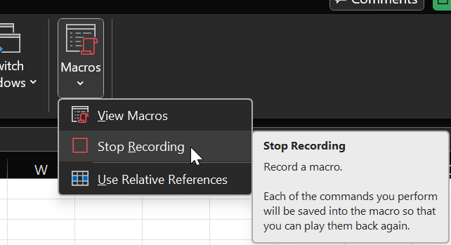
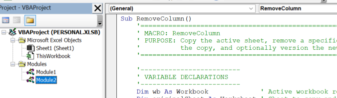

# Importing and Updating a Global Macro in Excel

This guide explains how to import and update a **global macro** in Excel, which can be used in any workbook.

---

## Importing a Global Macro
### Step 1: Open the Visual Basic for Applications (VBA) Editor

1. Open Excel.
2. Press `Alt + F11` to open the **VBA Editor**.
3. In the VBA Editor, locate the **Project Explorer** on the left.
   - If it’s not visible, press `Ctrl + R`.

### Step 2: Open Your Personal Macro Workbook

Excel stores global macros in a hidden workbook called `PERSONAL.XLSB`.

1. In the VBA Editor, check for a project named `VBAProject (PERSONAL.XLSB)`.
2. If it does **not exist**, create it by recording a macro:
   3. Return to Excel.
   4. Go to **View → Macros → Record Macro**
   
   5. In the **Record Macro** dialog:
      - Set **Store macro in** to `Personal Macro Workbook`.
      
   6. Click **OK**, then immediately **Stop Recording**.
      

> This creates `PERSONAL.XLSB` if it doesn’t already exist.

### Step 3: Import a Macro

1. Press `Alt + F11` to open the **VBA Editor**.
2. Right-click `VBAProject (PERSONAL.XLSB)` → **Import File...**
   3. Select the file to import (e.g., `FormatBomForCadDatalink.bas`).
      ![[import_file2.png]]
   4. Double-click the created module to view or edit the script.
   5. **Save** your changes.
      

> **Tip:** You may run into an error relating to a hidden workbook
> `PERSONAL.XLSB` is hidden by default. To view it: **Excel → View → Unhide → select PERSONAL.XLSB**. Do **not** delete or rename it. When prompted about saving any changes to your personal workbook, do save the changes.

### Step 4: Assign a Shortcut to Your Global Macro

1. Switch back to Excel (not the VBA Editor).
2. Go to **View → Macros → View Macros** (`Alt + F8`).
3. In the **Macro** dialog:
   - Set **Macros in** to `All Open Workbooks` or `PERSONAL.XLSB`.
   - Select the macro you imported (the function name will be displayed).
4. Click **Options…**.
5. In the **Macro Options** dialog:
   - Enter a **shortcut key** (e.g., `q` for `Ctrl + Q`).
6. Click **OK**, then **Close** the Macro dialog.

### Step 5: Test Your Macro

1. Open any Excel workbook.
2. Press your assigned shortcut (e.g., `Ctrl + Q`).
3. The macro should run in any workbook.

---

## Updating a Macro

You can update a macro by either:
1. Overwriting the old script.
2. Importing the new script and deleting the old one.

### Option 1: Overwrite the Old Script

1. Open the VBA Editor Project Explorer.
2. Double-click the module to update.
      ![[vba_editor_overwrite.png]]
3. Delete the current code and paste in the new script (can be opened in a text editor).
4. **Save** your changes.
5. Assign a shortcut (refer to Step 4: Assign a Shortcut to Your Global Macro).

### Option 2: Import and Delete a Macro

1. Open the VBA Editor Project Explorer.
2. Right-click `VBAProject (PERSONAL.XLSB)` → **Import File...**
   - Select the file to import (e.g., `FormatBomForCadDatalink.bas`).
      ![[import_file2.png]]
3. Assign a shortcut (refer to Step 4: Assign a Shortcut to Your Global Macro).

#### Remove the Old Macro

1. Open the VBA Editor Project Explorer.
2. Right-click the module you want to remove.
3. Select **Remove [ModuleName]**.
      ![[remove_module.png]]

---

v2.0.0