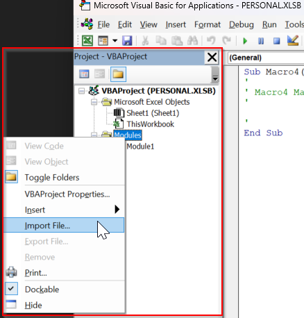

# Importing A Global Macro in Excel

This guide will help you create a **global macro** in Excel, which can be used in any workbook.

---

## Step 1: Open the Visual Basic for Applications (VBA) Editor

1. Open Excel.
2. Press `Alt + F11` to open the **VBA Editor**.
3. In the VBA Editor, locate the **Project Explorer** on the left.  
   - If you don't see it, press `Ctrl + R` to open it.

---

## Step 2: Open Your Personal Macro Workbook

Excel uses a hidden workbook called `PERSONAL.XLSB` to store global macros.

1. In the VBA Editor, look for a project named `VBAProject (PERSONAL.XLSB)`.
2. If it does **not exist**, you need to create it by recording a macro:
   1. Go back to Excel.
   2. Go to **View → Macros → Record Macro** (or `Alt + T + M + R`).
   
   3. In the **Record Macro** dialog:
      - Set **Store macro in** to `Personal Macro Workbook`.
      
   4. Click **OK**, then **Stop Recording**.
   
   5. This will create the `PERSONAL.XLSB` workbook if it wasn’t already there.

---

## Step 3: Set Up A Macro

1. Press `Alt + F11` to open the **VBA Editor**.
2. In the VBA Editor, expand `VBAProject (PERSONAL.XLSB)`.
3. Right click **Modules** and select **Import File...**
   - Select the file to import

1. You can double-click the created module to access the script
	- **Save** 

---

💡 **Tip:** You may run into an error relating to a hidden workbook  
 `PERSONAL.XLSB` is hidden by default. Do not delete or rename it, or your global macros will be lost.
- To view it: In **Excel**, **View → Unhide → select PERSONAL.XLSB**.

## Step 4: Assign a Shortcut to Your Global Macro

1. Go back to **Excel** (not the VBA Editor).  
2. Go to **View → Macros → View Macros** (or press `Alt + F8`).  
3. In the **Macro** dialog:
   - Set the **Macros in** dropdown to `All Open Workbooks` or `PERSONAL.XLSB`.
   - Select the macro you imported.  
4. Click **Options…**.
5. In the **Macro Options** dialog:
   - Enter a **shortcut key** (e.g., type `q` for `Ctrl + Q`).
6. Click **OK**, then **Close** the Macro dialog.

---

## Step 5: Test Your Macro

1. Open any Excel workbook.  
2. Press your assigned shortcut (e.g., `Ctrl + Q`).  
3. The macro should run, no matter which workbook is active.

---

